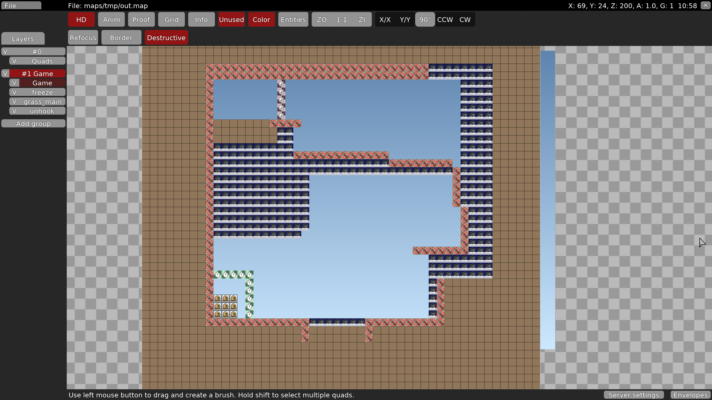

# teeworlds-reverse-gametiles
Tool for mappers that like to map with gametiles first. It generates tiles based on gametiles so the opposite of what "Game Tiles" button does in the editor.

## Setup

    python -m pip install -r requirements.txt

## Example usage

Given a teeworlds map that has only gametiles placed and a few tile layers ready to use.

Run the ``reverse-gametiles.py`` script and pass in which layers to use as arguemnt.
The collision layer in this case is grass_main which is in 3rd layer in the 2nd group.
But since this script is for nerds we start counting from zero. So to place a grass_main tile
on every collision tile from the game layer we use ``--collision 1:2`` fromat being ``group:layer``.
We do the same for the freeze which is the 2nd layer in the 2nd group so we use ``--freeze 1:1``.
The unhook layer is the 3rd layer of the 2nd group so we do ``--unhook 1:3``.
As last two positional arguments we provide the input and then the output map.
So in this example we read in the map ``~/.teeworlds/maps/tmp/sample.map``
then we apply magic to it and spit it out into the file ``~/.teeworlds/maps/tmp/out.map``

	./reverse-gametiles.py \
		--collision 1:2 \
		--freeze 1:1 \
		--unhook 1:3 \
		~/.teeworlds/maps/tmp/sample.map \
		~/.teeworlds/maps/tmp/out.map

